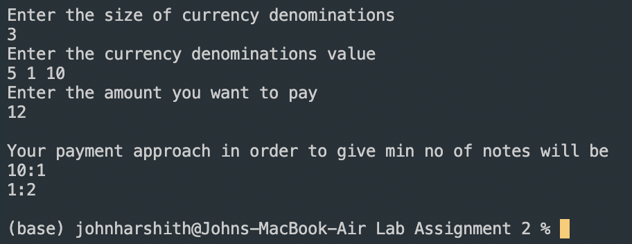

# John Harshith Algorithms Lab Solution

## Problem Statements

Question 1 - PayMoney. processes thousands of transactions daily amounting to crores of Rupees. They also have a daily target that they must achieve. Given a list 
of transactions done by PayMoney and a daily target, your task is to determine at which transaction PayMoney achieves the same. If the target is not achievable, 
then display the target is not achieved.

Question 2 - You are a traveler and traveling to a country where the currency denominations are unknown and as you travel, you get to know about the denomination in 
random order. You want to make a payment of amount x, in such a way that the number of notes you give is minimum. Assume that the denominations are in such a way 
that any amount can be paid.

Input : Take input of all the currency denominations (random order) and take input of the amount that you want to pay.

Output : Print the minimum no of notes that you will be using to pay the net amount.

## Problem 1 Outputs

\

## Problem 2 Outputs

\
\

